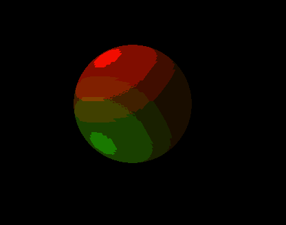

# Programa visualizador de shaders

Opción E de la segunda tarea del curso CC7515-1 - Computación en GPU del departamento de computación de la Universidad de Chile, "Programa visualizador de shaders", desarrollada por el alumno Heinich Porro, entre agosto y septiembre del año 2019.

## Screenshots



## Instalación
Se utilizaron librerías simples que pueden ser compiladas por cmake, más las librerías GLEW y GLFW, que tienen que estar instaladas previamente y ser visibles en el PATH.
Es posible compilarla usando cmake, siguiendo la siguiente secuencia de comandos:

Con una consola ubicada en la carpeta principal del proyecto, que llamaremos ${TAREA2} desde ahora, se llama el siguiente comando:

```
mkdir build
```

Luego se ubica la consola en la carpeta recién creada, y se hace el build de cmake:

```
cd build
cmake ..
```

Entonces, se usa make para generar el ejecutable de la tarea:

```
make
```

Entonces el ejecutable de la tarea, llamado Tarea2.exe o Tarea2, debe estar en la carpeta o en una carpeta dentro de la carpeta ${Tarea2}/build.


## Herramientas utilizadas en el desarrollo de la tarea

* [c++14](https://isocpp.org/wiki/faq/cpp14) - Lenguaje de programación utilizado.
.
* [CMake](https://cmake.org/) - CMake familia de herramientas de código abierto diseñadas para hacer building, testing y packaging de software.
* [GLFW](https://www.glfw.org/) - is an Open Source, multi-platform library for OpenGL, OpenGL ES and Vulkan development on the desktop.
* [GLEW](http://glew.sourceforge.net/) - Cross-platform open-source C/C++ extension loading library.
* [glm](https://glm.g-truc.net/) - Librería en c++ para el manejo de matrices y vectores.
* [stb_image](https://github.com/nothings/stb/blob/master/stb_image.h) - Librería abierta en c++ para el manejo de archivos de imágenes.
* [Bouml](https://bouml.fr/) - Herramienta utilizada para generar diagramas UML.
* [tinyobjloader](https://github.com/tinyobjloader/tinyobjloader) - Tiny but powerful single file header only wavefront obj loader written in C++03.

## Versionamiento

Se usó git para mantener un historial del desarrollo de la tarea. El repositorio está hosteado en [https://github.com/hporro/Tarea2GPU](https://github.com/hporro/Tarea2GPU) (repositorio privado hasta terminar la tarea).

## Autor

* **Heinich Porro** - [hporro](https://github.com/hporro)

## Licencia

Este projecto esta bajo la licencia MIT - ver el archivo [LICENSE.md](LICENSE.md) para más detalles.

## Agradecimientos

* A [Joey de Vries](https://joeydevries.com/#home), por hacer la página [learnOpenGL](https://learnopengl.com/), que me sirvió muchísimo para aprender lo necesario de OpenGL, shaders y algoritmos de lighting para esta tarea.
* A [João Paulo](https://3dtextures.me/) por la textura utilizada para el shader normal mapping.
